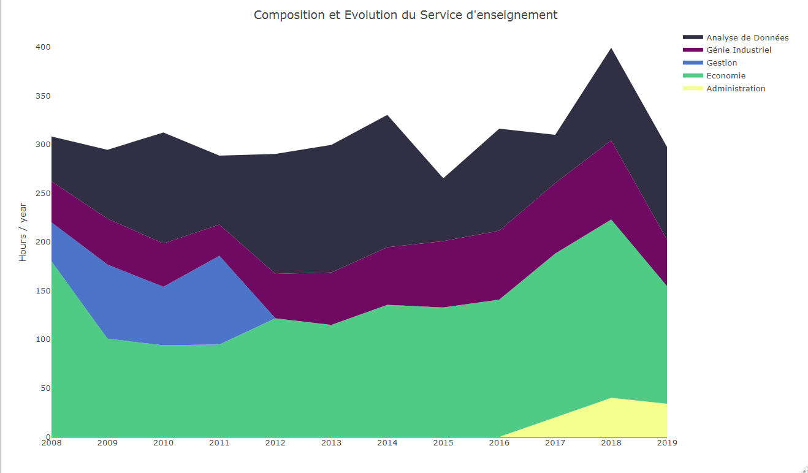

+++
# A Demo section created with the Blank widget.
# Any elements can be added in the body: https://sourcethemes.com/academic/docs/writing-markdown-latex/
# Add more sections by duplicating this file and customizing to your requirements.

widget = "custom"  # See https://sourcethemes.com/academic/docs/page-builder/
headless = true  # This file represents a page section.
active = true # Activate this widget? true/false
weight = 20  # Order that this section will appear.

title = ""
subtitle = ""

[design]
  # Choose how many columns the section has. Valid values: 1 or 2.
  columns = "1"

[design.background]
  # Apply a background color, gradient, or image.
  #   Uncomment (by removing `#`) an option to apply it.
  #   Choose a light or dark text color by setting `text_color_light`.
  #   Any HTML color name or Hex value is valid.

  # Background color.
  # color = "navy"
  
  # Background gradient.
  # gradient_start = "DeepSkyBlue"
  # gradient_end = "SkyBlue"
  
  # Background image.
  image = ""  # Name of image in `static/img/`.
  image_darken = 0.6  # Darken the image? Range 0-1 where 0 is transparent and 1 is opaque.

  # Text color (true=light or false=dark).
  text_color_light = false

[design.spacing]
  # Customize the section spacing. Order is top, right, bottom, left.
  padding = ["20px", "0", "20px", "0"]

[advanced]
 # Custom CSS. 
 css_style = ""
 
 # CSS class.
 css_class = "mini"
+++

# Activités Pédagogiques 

Mon activité d'enseignement se répartie entre les cours d'économie, d'analyse de données et une part relativement importante de mon service (env. 25%) est dédiée à l’encadrement de stagiaires et à des enseignements transverses sur le Génie Industriel. Depuis 2014, un tiers de mes enseignements sont dispensés en anglais.

**Figure 1 : Répartion de mon service depuis 2008**

Avec le soutien de financements Idex (articulés à l’école autour de l’Industrie 4.0), j’ouvre 2 nouvelles UE en 2020, avec mes collègues de GI:

1) [*Smart Analytics for Big Data*](/project/SmartAnalytics) : ce cours commun avec l'Ecole Polytechnique de Montréal est construit en collaboration avec les collègues de G-Scop et l’Imag. Outre la coordination de l’UE, mon objectif est de mobiliser les outils analyse et les modèlisations des données spatiales et temporelles, que j’utilise en recherche, et qui sont en cohérence avec le besoin de l’industrie d’étudier, par exemple, des données de transport en logistique, les problématiques de localisation géographique, etc. 

2) [*Digital transformation and organization: digital goods, eco-system and markets*](/project/DigitalTransfo)  : ce projet d’UE recoupe les différentes dimensions de la transformation digitale, économique, technologique, technique, organisationnelle. Je coordonne ce projet d’UE pluridisciplinaire avec les collègues de G-Scop. Pour ces deux UE, l’enseignement sera en anglais, l’objectif à moyen terme est d’internationaliser l’équipe enseignante en invitant des collègues étrangers spécialistes de certains thèmes ou méthodes.

## Activité de recherche

Mon activité de recherche, depuis mon doctorat se traduit par la publication de quinze articles dans des revues à comité de lecture, un ouvrage et deux chapitres d'ouvrages principalement en économie, en transport, en géographie. 

Mes travaux s’inscrivent dans le cadre de la micro-économétrie appliquée aux comportements de transports et portent sur la modélisation des comportements de choix des individus en matière de temps de transport et temps d’activités, ainsi que les facteurs qui les influencent. Ils se structurent autour de trois perspectives méthodologiques différentes : la première relève des modèles de choix discrets appliqués aux choix de transport (modes de transport, d’activités, etc), et plus généralement de produits (produits à label environnemental, produits innovants), la seconde des modèles de durées pour l’étude des choix de durées de transport et la troisième des modèles d’équations structurelles pour intégrer dans les modélisations les variables latentes difficilement mesurables et observables (par exemple les motivations et attitudes environnementales).

Parallèlement, j’ai également une activité de co-encadrement de doctorants : Hélène Bouscasse, doctorante de l’Université de Lyon (2014-2017), en co-encadrement avec P. Bonnel (LET) et Natalia Duarte Ferrin, doctorante de l’Université de Grenoble (2012-2015), en co-encadrement avec Van-Dat Cung et P. Lemaire (GScop). J’encadre aussi régulièrement des d’étudiants en master 2 recherche (7 étudiants en M2R ou équivalent de l’Université Lyon 2, de l’UPMF ou de Grenoble-Inp).

Enfin, l’essentiel de mes activités de recherche ont été financées par des projets de recherche. J’ai été fortement impliqué au montage des projets financés auprès d’organismes publics lors de réponses à des appels à projets émanant de l’ANR, le Predit, la Structure fédérative de recherche INNOVACS, de l’Université Pierre Mendès France ou le PUCA (Plan Urbanisme Construction Architecture).

Mes publications sont réparties en une publication en économie classée 1 CNRS (rang A HCERES), deux publications classées 2 CNRS (rang A HCERES), deux publications classées 3 CNRS (rang B HCERES), six publications classées 4 CNRS (rang B & C HCERES). Enfin, deux des trois autres publications non classées en économie sont classées en géographie (rang A ou B HCERES).

Articles dans des revues à comité de lecture (* revues classées, rang HCERES, rang CNRS 2015) :

**Rang HCERES des revues à comité de lecture**

|rang |A                                |B  |C  |Autres (non classés) |Total |
|----:|:------------------------------:|:---:|:---:|:--------------------:|:-----:|
|nb   |3                                    |3  |5  |4                    |15    |

**Rang CNRS des revues à comité de lecture**

|rang |1              |   2  |   3  |4   | Autres (non classés) |Total |
|----:|:--------------:|:---:|:---:|:---:|:--------------------:|:-----:|
|nb   |1              |   2  |   2  |6   | 4                  |  15    |

