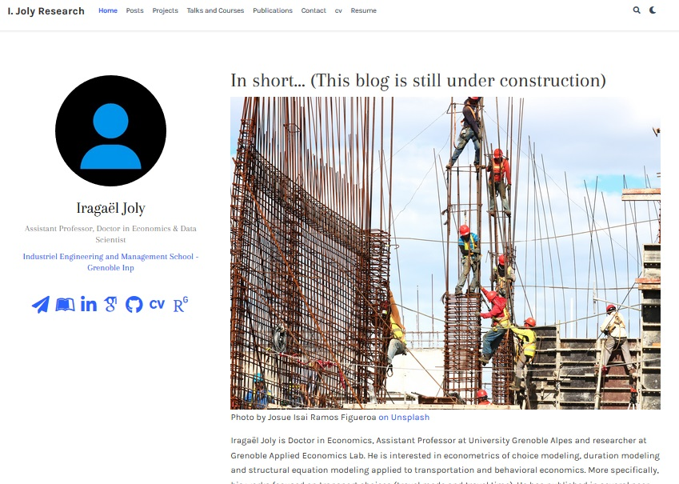

# Où est quoi ?

Ce premier essai de blogdown m'a paru être un jeu de piste. Pour pouvoir modifier une petite partie, un bout de texte, etc. il faut savoir où cela se cache et comment ça se calibre. 

Cette note est écrite pour répondre à ce besoin ressenti.




## A gauche:  
Les éléments de gauche sont modifiés dans : `content\authors\admin\_index.md`.
Le YAML, définit plusieurs sections: auteur, rôle, organisation et les liens des réseaux sociaux qui apparaissent à gauche

### La description de l'auteur

La section `authors:` définie plusieurs champs :

- Nom et prénom:  `name:`
- Rôle: `role:`
- L'organisation:  dans le YAML. En section `organizations`. On précise le `name:` et l' `url:`
- Les icônes de liens (LinkedIn, ResearchGate, etc.): `content\authors\admin\_index.md` : dans le YAML. En section `social`, on précise l'icône (à la fois le nom de l'icône dans le paquet d'où il est [téléchargé](https://fontawesome.com/) ) et le lien interne (une autre page du blog - cv ou résumé ou contact) ou externe (une url)

```{ }
authors:
name: MySelf
role: My role
bio: My research interests include...
organizations:
- name: The best Institution ever 
  url: http://genie-industriel.grenoble-inp.fr//
social:
- icon: paper-plane
  icon_pack: fas
  link: /contact
```

###  Remarques

- La bio: `bio:` : La bio apparaît en bas de page des diffétentes pages du blog: des posts, des projets, le résumé, etc.
- Attention, l'indentation est sensible ici


## A droite

Deux fichiers décrivent cette partie

- Le titre: est dans  `content/home/about.md`
- l'image: `content\authors\admin\_index.md` en dehors du / après le YAML
- le petit texte: `content\authors\admin\_index.md`  en dehors du /après le YAML

### Les listes automatiques :

- *Interests*: `content\authors\admin\_index.md`:  En section `interests`, on décrit une liste à points d'intérêts
- *Education*: `content\authors\admin\_index.md`:  En section `education`, on décrit un ensemble de `courses`. Chaque `course` est décrit par son nom `course`, son `institution` et une annèe `year`

```{ }
interests:
- I 
- and myself
education:
  courses:
  - course:  Economics
    institution:  University
    year: 2017
```
    

## Les éléments consituants la page

### Ordre des éléments et sections sur la page

L'ordre d'affichage des sections sur la page principale vient du poids ou rang défini sur chaque fichier de définition de la section :

`content/home/myfile.md` où `myfile.md` pourra être `skills.md` ou `publications.md`.

Dans le toml de chaque fichier de section, on retrouve les champs :

- `widget`, `headless` dont la définition m'échappe encore (malgré https://sourcethemes.com/academic/docs/page-builder/). `widget="pages"` affiche la section complète, alors que `widget="portfolio"` affiche une mosaique clicable.

- `active`: pour rendre actif ou nom un widget 
- `weight`: pour définir la position de la section en page principale
- `title` et `subtitle`: définissent les titres

```{ }
widget = "pages"  # See https://sourcethemes.com/academic/docs/page-builder/
headless = false  # This file represents a page section.
active = true  # Activate this widget? true/false
weight = 90  # Order that this section will appear.
title = "Publications"
subtitle = ""
```

### Le menu en haut de page
Il se définit dans `config/_default/menus.toml`
On définit une section par l'accroche `main` définissant `name` l'élément de menu, `url` indiquant le lien interne de la page ciblée et `weight` précisant le poids ou le rang dans l'ordre d'apparition du menu. 
La liste et l'ordre de éléments du menus peuvent être différents de ceux affichés sur la page principale.

La balise associée au bouton est le nom du fichier associé présent dans `content/home`. Par exemple pour le bouton `Projects` du menu, on précise un `name="Projet"` et un `url = "#projects"` qui correspond au fichier `projects.md`.

```{ }
[[main]]
    name = "cv"
    url = "#cv"
    weight = 70
```


### Les skills

Les icônes proviennent de

- https://fontawesome.com/icons?d=gallery
- https://jpswalsh.github.io/academicons/

### Les contacts et la map

Dans `config/_default/params.toml`


## La mise en page

Dans `config/_default/params.toml`

```{r}
# Color theme.
#   Choose from `default`, `ocean`, `forest`, `dark`, `apogee`, `1950s`, `coffee`, `cupcake`, `strawberry`.
color_theme = "iragael"


# Override the theme's font set (optional).
#   Latest font sets (may require updating): https://sourcethemes.com/academic/themes/
#   Browse built-in font sets in `themes/academic/data/fonts/`
#   Browse user installed font sets in `data/fonts/`
font = "iragael"

# Choose a font size.
# Sizes: XS (extra small), S (small), M (medium), L (large - DEFAULT), XL (extra large)
font_size = "S"

``` 

# Fonctions de base

`blogdown::build_site()`

# Workflow :

0. Installer R et RStudio
1. Créer un BlogDown avec RStudio
2. Créer son GitHub
3. Installer Git sur sa machine (certainement optionel, sauf si instal de l'add-on Git dans RStudio ?)
4. Synchroniser Git et RStudio
   + Commit
   + Push
5. Créer un compte Netlify ou relier Netlify au compte GitHub
6. Depuis Netlify, 
   + créer un nouveau site web, en ciblant un repo de GitHub
   + Accéder aux option de GitHub pour autoriser l'accés aux repo depuis Netlify
7. Laisser mouliner.

Des fois ça marche... d'autres moins

  
## REste à voir 

1. comment changer le thème hugo 'on live'
2. Comment utiliser la clé de connexion ssh entre Rstudio et GitHub


# Synchronising with GitHub

*R packages* Git and GitHub:

http://r-pkgs.had.co.nz/git.html#git-init

# Top Tuto
*Excellent blog de Peter Baumgartner* : 

https://notes.peter-baumgartner.net/

https://notes.peter-baumgartner.net/tutorial/blogdown-tutorial-part-4/


# Références et Web Sites

+ https://github.com/Iragael38/

+ https://app.netlify.com/teams/ijoly-research/sites


## Tuto

+ https://stateofther.github.io/finistR2017/blogdown.html

https://lcolladotor.github.io/2018/03/07/blogdown-insert-image-addin/

https://support.rbind.io/2017/06/16/academic-site-apreshill/

https://alison.rbind.io/post/2017-06-12-up-and-running-with-blogdown/

https://www.dsquintana.blog/free-website-in-r-easy/

https://lmyint.github.io/post/hugo-academic-tips/

## Sites & Blog appréciables

http://lcolladotor.github.io/

https://rubenfcasal.github.io/post/getting-started/

http://www.pik-potsdam.de/~pichler/blog/post/set-this-up/setting-up-this-site/

https://lmyint.github.io/post/hugo-academic-tips/


## Sites d'images

### Libres

https://unsplash.com/explore/searches

### Web comics

https://xkcd.com/

# CAcher une section

Dans `\content\home\` on trouve les fichiers de design des sections, dont l'option `active=true/false`

# Inserer une image dans un post

L'insertion d'image reste une opération délicate pour moi.

J'énumère ci-dessous plusieurs méthodes. Toutes ne fonctionnent pas et je ne sais pas encore pourquoi...

Cela nécessite de copier l'image à charger dans un dossier présent dans static (éventuellement le dossier du post ou non)

``


``


``


`{width=50%}`

{width=50%}


Insertion avec informations, captions, etc.

```{}
<figure class="kg-card kg-card-image kg-card-hascaption">
    Photo by Josue Isai Ramos Figueroa  <a href="https://unsplash.com/photos/qvBYnMuNJ9A">on Unsplash </a>
    </figcaption>
</figure>
```

<figure class="kg-card kg-card-image kg-card-hascaption">
    Photo by Josue Isai Ramos Figueroa  <a href="https://unsplash.com/photos/qvBYnMuNJ9A">on Unsplash </a>
    </figcaption>
</figure>


### Insérer une image dans un en-tête de post:

On précise les éléments: `caption` et `focal point`. Mais l'image doit être dans le dossier du post avec le nom  `featured.jpg`.
*Remarque*, le nom du fichier du post est `index.Rmd`

```{}
image:
  caption: Photo by Josue Isai Ramos Figueroa  <a href="https://unsplash.com/photos/qvBYnMuNJ9A">on Unsplash </a>
  focal_point: 'center'
```

### Insérer une image dans le coeur d'un post

On insère l'image par l'instruction suivante.
Le fichier image est dans le dossier du post (une copie dans `static\img\` semble utile)

```{}


```


### Website icon

Save your main icon and mobile icon as square PNG images named `icon.png` and apple-touch-icon.png, respectively. Place them in your root `static/img/ folder`.

## `md` Markdown Syntax 

- [Markdown-Cheatsheet](https://github.com/adam-p/markdown-here/wiki/Markdown-Cheatsheet)


# Références

- Xie, Yihui. 2017a. Blogdown: Create Blogs and Websites with R Markdown. https://github.com/rstudio/blogdown.
