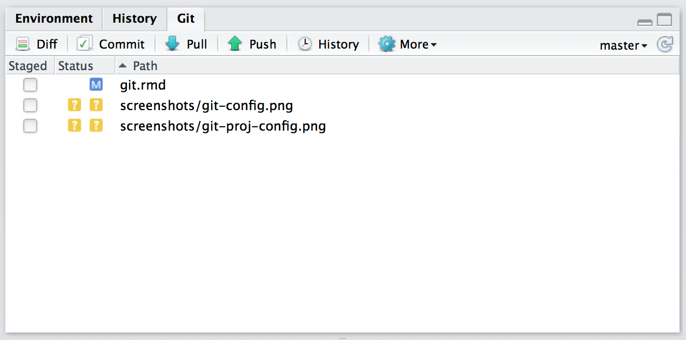

## Initial set up

1. Installation de Git (application) 
  
  + Windows: http://git-scm.com/download/win.
  + OS X: http://git-scm.com/download/mac.
  + Debian/Ubuntu: sudo apt-get install git-core.
  + Other Linux distros: http://git-scm.com/download/linux.

2. Création d'un compte sur la plateform ([Gitlab](https://gricad-gitlab.univ-grenoble-alpes.fr/users/sign_in) donne un compte aux étudiants UGA - sinon utilisez  [GitHub](https://github.com) )
  
  + générez une clé SSH. La clé SSH sécurise les communications avec les sites web sans besoin de mots de passe. Deux clés sont créées : une publique et une  privée.
  + Avec R, vous pouvez vérifier si vous possédez déjà une paire de clés :
  
```{r}
    file.exists("~/.ssh/id_rsa.pub")
```

  + Si l'instruction renvoie `FALSE` vous devez créer une nouvelle clé:
      - Vous pouvez suivre les instructions sur Gitlab, GitHub et 
      - aussi celles données par RStudio: dans le menu `global options`, onglet  `Git/SVN` et click “Create RSA key…”

3. Relier votre application installée et votre compte :

  + Dans la console (ou *terminal* ou *shell*), renseignez votre nom et email

```{ }
    git config --global user.name "YOUR FULL NAME"
    git config --global user.email "YOUR EMAIL ADDRESS"
```

  + Vérifier la configuration :  `git config --global --list`
  + Vous indiquez ensuite votre clé SSH publique sur GitLab ou GitHub (https://github.com/settings/ssh). Vous trouverez votre clé sous RStudio dans `global options\ Git/SVN` en cliquant `View public key`.

{width=50%}

4. Créer un dossier-Git en local

  + Il s'agit de créer un dossier local, reconnu par Git. il contiendra donc les fichiers de configurations de Git dans un dossier `.git` et une base de données enregistrant les l'historique des versions de votre code.
  + Le dossier-Git local devra ensuite être partagé.
  + Depuis RStudio:   
     A. Vous voulez créer un nouveau projet   
       - il vous faut créer un *repository* sur GitLab (ou GitHub), puis le cloner en copiant l'url  
       - Depuis RStudio: créer un nouveau projet  
       - en sélectionnant `Version Control`, puis `Git`  
       - renseigner les différents champs, dont l'url que vous avez copier  
       - Le nouveau projet est synchrone avec votre repo Git
       
     B. A partir d'un projet existant :   
       - dans les options du projet, dans l'onglet `Git/SVN` : changer l'option `Version control system` de  `None` à  `Git`   
       - Vous devrez redémarrer RStudio   
       - dans le terminal: lancer  `git init`   
       - Redémarrer RStudio et ouvrez votre projet   


## Git dans RStudio
## Interface

Une fois Git initialisé, vous verrez deux nouveaux éléments apparaître dans l'interface de RStudio:

- l'onglet git, dans le cadrant en haut à droite. Il vous montre quels fichiers ont été modifiés et propose les boutons des commandes principales de Git
          
{width=50%}      
          
          
- dans la barre d'outils, vous avez accès au menu déroulant qui inclut les commandes Git et GitHub qui s'appliquent au fichier en cours.

{width=25%}   

## Usages

Les modifications des lignes de codes, des fichiers et des dossiers, en gros de tout le projet, sont enregistrés et accessibles.

Dans l'onglet Git, on trouve la liste des modifications réalisées selon qu'il s'agit de :
 
 + {scale=10%} *Modification*: le contenu du fichier a été modifié
 + {scale=10%} *Untracked*: un nouveau fichier a été ajouté au projet
 + {scale=10%} *Supprimé*: un fichier a été supprimé

On peut aussi faire une analyse de différence entre versions (celle en local et celle stockée sur Git) :  {scale=10%}

 {width=50%}

Les modidications apparaissent en vert, pour les ajouts, en rouge, pour les suppressions. Les lignes grises reprennent les éléments stables autours des modifications.
    
    
### Enregistrement des modifications

Une notion essentielle de Git est le `commit`.

Le `commit` est un instantané du code à un moment donné. Ils sont utilisés comme des relais ou des points d'ancrage.

Après un `commit`, modifier le code est sans risque, puisqu'on peut toujours revenir au relais précédent. 

Chaque `commit` comprend 5 composants clé:

  - un identifiant unique appelé SHA (*secure hash algorithm*)
  - un `changeset` décrivant quels fichiers ont été ajoutés, modifiés, supprimés
  - un message lisible décrivant le `commit`
  - un parent: le `commit` qui précède celui décrit (sauf pour le 1er `commit`, et sauf pour les fusions (*merge* entre 2 parents)
  - un auteur du `commit`
  

{width=50%}


Avec RStudio, la fenêtre de `commit`est composée de :

- en haut à gauche, les modifications en cours
- en haut à droite, vous pouvez renseignez un message décrivant les modif du `commit
- en bas, les différences sur le fichier séelctionné en haut à gauche
    
La fenêtre de `commit` permet de faire ces deux étapes. Cliquer {scale=10%}, ou `Ctrl + Alt + m`

Un `commit` est créé :
  
  - en sauvegardant le fichier modifié
  - ouvrant la fenêtre de `commit`
  - en sélectionnant les fichiers inclus dans le nouveau  `commit`. On coche les fichiers à inclure. `Ctrl + A` pour tous les sélectionner et `Entrée` pour tous les cocher
  - en décrivant le `commit`
  - en cliquant `commit`
 

## Commit best practices

Dasn l'idéal chaque `commit` doit être minimal mais complet:

- minimal: un `commit` doit contenir les chagement liés à un seul problème. Cela facilitera la compréhension du `commit` et sa description en un seul message. A chaque problème son `commit`!
- complet: un `commit` doit résoudre le problème qu'il traite. Il devrait inclure un test démontrant la résolution du problème

Chaque message de `commit`devrait 

- être concis et claire. Indiquer ce qui est fait avec suffisament de détails.
- décrire le pourquoi et non le quoi ou le comment. L'analyse des différences montrera ce qui a été fait. Le message doit être synthétique et décrire les raisons des modifications réalisées

Ainsi, le travail à plusieurs, le codage simultané devrait être faciliter, notamment la résolution de conflits entre codes. Les nouveaux venus dans les projets comprendront mieux ce qui est fait. 
Avec le suivi de version, l'apparition des bugs sera plus simple à suivre.

Le `commit`  c'est surtout une documentation pour soi !

Bien entendu, dans la pratique, tout n'est pas toujours parfait... Plusieurs petits `commit` mal renseignés, valent mieux qu'un gros bien fait.

## Webography

- [Git and GitHub](http://r-pkgs.had.co.nz/git.html)

- [Happy Git and GitHub for the useR - Jenny Bryan](https://happygitwithr.com/)

- [Tutorial: Intro to Git & GitHub for the R User](https://github.com/bcgov/bcgov-data-science-resources/wiki/Tutorial:-Intro-to-Git-&-GitHub-for-the-R-User)

- [Statistique et Logiciel R](https://statistique-et-logiciel-r.com/versionnage-de-vos-scripts-rstudio-git/)
